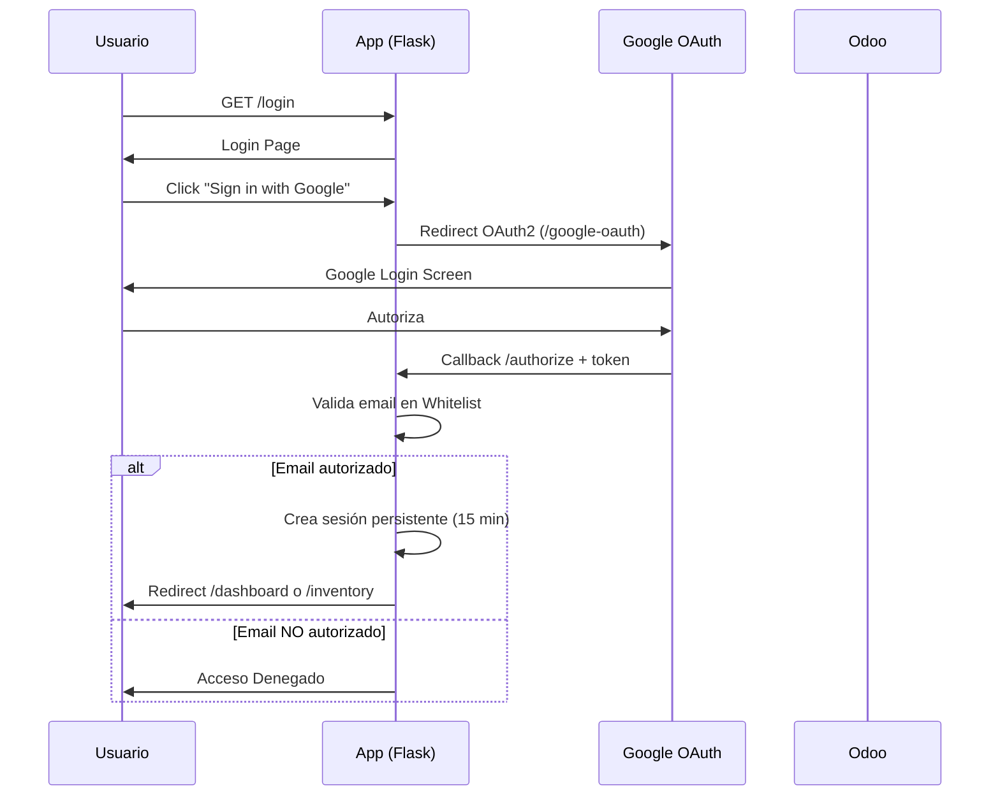

# 📐 Project Architecture Blueprint - Inventario Stock Web

**Generado:** 23 de marzo de 2026  
**Última Actualización:** 26 de marzo de 2026 — Fase 3 completa + cierre de sesión por inactividad (modal frontend + keep-alive)  
**Tecnología Principal:** Python Flask 3.1.1  
**Patrón Arquitectónico:** Layered Architecture (3 capas)  
**Tipo de Aplicación:** Web Monolítica con SSR (Server-Side Rendering)

---

## 🏗️ 1. Resumen Arquitectónico

### 1.1 Stack Tecnológico

**Backend:**
- Python 3.11+
- Flask 3.1.1 (Web Framework)
- Flask-Talisman 1.1.0 (Security headers CSP/HSTS)
- Flask-Limiter 3.12 (Rate limiting — instalado, pendiente activación)
- Authlib 1.6.8 (OAuth2 Google)
- xmlrpc.client + defusedxml 0.7.1 (Integración Odoo — protegido contra XXE)
- psycopg2-binary 2.9.x / SQLite (Analytics DB)
- Pydantic 2.11.7 (Validación de inputs en endpoints)
- config.py (8 clases de configuración centralizada)
- schemas.py (5 schemas Pydantic para validación de formularios)
- logging_config.py (Logging estructurado, reemplaza print())

**Frontend:**
- Jinja2 Templates (SSR)
- Bootstrap 5.3 + Bootstrap Icons
- Chart.js 4.4.1 (Gráficos interactivos)
- ECharts 5.4.3 (Gráficos avanzados)
- html2canvas + jsPDF (Exportación PDF)

**Integraciones:**
- Odoo 14+ (XML-RPC API)
- Google OAuth2 (Autenticación)
- Supabase PostgreSQL (Analytics)

### 1.2 Principios Arquitectónicos

1. **Separación de Responsabilidades**: Capas bien definidas (Presentación, Lógica, Datos)
2. **Seguridad por Diseño**: OAuth2, whitelisting multinivel, sesiones seguras
3. **Performance**: Caché LRU, actualización asíncrona, índices DB
4. **Simplicidad**: Arquitectura monolítica para despliegue simple
5. **Resiliencia**: Reintentos automáticos, manejo de errores, fallback a SQLite

---

## 🎯 2. Arquitectura de Capas

```
┌─────────────────────────────────────────────────────────────┐
│                    PRESENTATION LAYER                        │
│  ┌──────────────┐  ┌──────────────┐  ┌──────────────┐      │
│  │   Templates  │  │  Static CSS  │  │ Static JS    │      │
│  │  (Jinja2)    │  │  (style.css) │  │ (script.js)  │      │
│  │  6 plantillas│  │  Bootstrap 5 │  │  Chart.js    │      │
│  └──────────────┘  └──────────────┘  └──────────────┘      │
└─────────────────────────────────────────────────────────────┘
                            ↕
┌─────────────────────────────────────────────────────────────┐
│                    BUSINESS LOGIC LAYER                      │
│  ┌──────────────────────────────────────────────────────┐   │
│  │                     app.py                            │   │
│  │  • Routing (11 endpoints + /api/keep-alive)         │   │
│  │  • Flask-Talisman (CSP/HSTS/Headers OWASP)          │   │
│  │  • Session Fingerprint SHA-256 (anti-hijacking)      │   │
│  │  • Session Expiry 15 min (inactividad) + modal JS    │   │
│  │  • Authorization (3 niveles: whitelist/dashboard/admin)│  │
│  │  • Pydantic v2 schemas — validación en 5 endpoints   │   │
│  └──────────────────────────────────────────────────────┘   │
│  ┌─────────────┐  ┌──────────────┐  ┌───────────────────┐  │
│  │  schemas.py │  │  config.py   │  │ logging_config.py │  │
│  │  5 schemas  │  │  8 clases    │  │ Logging estructura│  │
│  │  Pydantic v2│  │  Config.*    │  │ sin print()       │  │
│  └─────────────┘  └──────────────┘  └───────────────────┘  │
└─────────────────────────────────────────────────────────────┘
                            ↕
┌─────────────────────────────────────────────────────────────┐
│                      DATA ACCESS LAYER                       │
│  ┌─────────────────────┐      ┌──────────────────────┐     │
│  │   OdooManager       │      │   AnalyticsDB        │     │
│  │  • defusedxml XXE   │      │  • PostgreSQL/SQLite │     │
│  │  • XML-RPC Client   │      │  • Visit Tracking    │     │
│  │  • Data Mapping     │      │  • 8 métricas        │     │
│  │  • LRU Caching      │      │  • Dual DB Strategy  │     │
│  └─────────────────────┘      └──────────────────────┘     │
└─────────────────────────────────────────────────────────────┘
                            ↕
┌─────────────────────────────────────────────────────────────┐
│                    EXTERNAL SERVICES                         │
│  ┌──────────────┐  ┌──────────────┐  ┌──────────────┐      │
│  │  Odoo ERP    │  │ Google OAuth │  │  Supabase    │      │
│  │  (XML-RPC)   │  │   (OAuth2)   │  │ (PostgreSQL) │      │
│  └──────────────┘  └──────────────┘  └──────────────┘      │
└─────────────────────────────────────────────────────────────┘
```

---

## 🔐 3. Sistema de Autenticación y Autorización

### 3.1 Flujo de Autenticación OAuth2



### 3.2 Niveles de Autorización

| Nivel | Usuarios | Permisos | Implementación |
|-------|----------|----------|----------------|
| **1. Whitelist General** | 35+ usuarios | Acceso a `/inventory`, `/exportacion` | `whitelist.txt` o `WHITELIST_EMAILS` env |
| **2. Dashboard Users** | 6 usuarios específicos | Nivel 1 + `/dashboard` | Hardcoded en `app.py` (authorize + dashboard) |
| **3. Admin Users** | 2 usuarios (jonathan.cerda, ena.fernandez) | Nivel 2 + `/analytics` | Hardcoded en `app.py` ruta analytics |
| **4. Download Whitelist** | Variable | Exportación Excel | `DOWNLOAD_WHITELIST` env variable |

### 3.3 Configuración de Sesión (Seguridad)

```python
# app.py — configuración vía config.py (Config.Session.*)
app.config['PERMANENT_SESSION_LIFETIME'] = Config.Session.LIFETIME       # timedelta(minutes=15)
app.config['SESSION_COOKIE_SECURE'] = Config.Session.COOKIE_SECURE       # True (solo HTTPS)
app.config['SESSION_COOKIE_HTTPONLY'] = Config.Session.COOKIE_HTTPONLY   # True (anti-XSS)
app.config['SESSION_COOKIE_SAMESITE'] = Config.Session.COOKIE_SAMESITE  # 'Lax' (anti-CSRF)
```

**Middleware de Sesión + Fingerprint** (`@app.before_request`):
- Genera fingerprint SHA-256 (User-Agent + IP) para detectar session hijacking
- Verifica inactividad cada request; expira tras 15 minutos
- Actualiza `last_activity` timestamp en cada request válido
- Registra visitas en analytics (endpoints excluidos: `static`, exports)

**Frontend Timer de Inactividad** (`base.html` + `context_processor`):
- `inject_session_config()` inyecta `SESSION_TIMEOUT_MINUTES=15` y `SESSION_WARNING_MINUTES=2` a todos los templates vía Jinja2
- JS IIFE: escucha `mousemove`, `keydown`, `click`, `scroll`, `touchstart` para reset de `lastActivity`
- Sondeo cada 15 segundos: si `idle >= TIMEOUT - WARNING` muestra modal con countdown `M:SS`
- `POST /api/keep-alive`: renueva sesión sin recarga de página (responde `{ok: true}` o `401 expired`)
- Auto-redirige a `/logout` al llegar a 0 segundos (doble capa junto a la expiración backend)

**Security Headers** (`@app.after_request` + Flask-Talisman):
- `X-Content-Type-Options: nosniff`
- `X-Frame-Options: DENY`
- `X-XSS-Protection: 1; mode=block`
- `Referrer-Policy: strict-origin-when-cross-origin`
- `Permissions-Policy: geolocation=(), microphone=(), camera=()`
- CSP (solo producción): `default-src 'self'` + CDN whitelist
- HSTS (solo producción): `max-age=31536000`

---

## 📊 4. Modelo de Datos

### 4.1 Esquema PostgreSQL/SQLite - Analytics

```sql
CREATE TABLE page_visits (
    id SERIAL PRIMARY KEY,
    user_email VARCHAR(255) NOT NULL,
    user_name VARCHAR(255),
    page_url VARCHAR(500) NOT NULL,
    page_title VARCHAR(255),
    visit_timestamp TIMESTAMP NOT NULL DEFAULT CURRENT_TIMESTAMP,
    session_duration INTEGER DEFAULT 0,
    ip_address VARCHAR(50),
    user_agent TEXT,
    referrer VARCHAR(500),
    method VARCHAR(10)
);

-- Índices para performance
CREATE INDEX idx_visits_user ON page_visits(user_email);
CREATE INDEX idx_visits_timestamp ON page_visits(visit_timestamp DESC);
CREATE INDEX idx_visits_page ON page_visits(page_url);
```

### 4.2 Estructura de Datos - Odoo Integration

**Modelos Odoo consultados:**
- `stock.quant` - Inventario disponible
- `product.product` - Catálogo de productos
- `stock.lot` - Lotes y fechas de vencimiento

**Ejemplo de dato transformado:**
```python
{
    'product_id': 12345,
    'grupo_articulo_id': 67,
    'grupo_articulo': 'ALIMENTO BALANCEADO',
    'linea_comercial': 'Línea Nacional',
    'cod_articulo': 'PROD-001',
    'producto': 'Nombre Completo del Producto',
    'lugar': '0≥P≤3',  # Transformado de ubicación larga
    'fecha_expira': '15-06-2026',  # DD-MM-YYYY
    'cantidad_disponible': '1,234.56',
    'meses_expira': 3  # Calculado
}
```

---

## 🛣️ 5. Rutas y Endpoints

### 5.1 Rutas Públicas

| Endpoint | Método | Descripción |
|----------|--------|-------------|
| `/login` | GET | Página de login con botón Google OAuth |
| `/google-oauth` | GET | Inicia flujo OAuth2 |
| `/authorize` | GET | Callback OAuth2, valida whitelist |
| `/logout` | GET | Cierra sesión |

### 5.2 Rutas Privadas - Requieren Autenticación

| Endpoint | Método | Nivel Requerido | Descripción |
|----------|--------|-----------------|-------------|
| `/` | GET | Whitelist | Redirect a dashboard o login |
| `/inventory` | GET, POST | Whitelist | Vista de inventario principal con filtros |
| `/exportacion` | GET, POST | Whitelist | Vista inventario exportación |
| `/dashboard` | GET, POST | Dashboard Users | 6 gráficos interactivos + KPIs |
| `/analytics` | GET | Admin Users | Estadísticas de uso del sistema |
| `/export/excel` | GET | Download Whitelist | Exportar inventario a Excel |
| `/export/excel/exportacion` | GET | Download Whitelist | Exportar inventario exportación |
| `/api/keep-alive` | POST | Whitelist (sesión activa) | Renovar sesión desde frontend (timer JS) |

### 5.3 Patrones de Routing

**Patrón 1 - Verificación de Sesión:**
```python
if 'username' not in session:
    return redirect(url_for('login'))
```

**Patrón 2 - Verificación de Permisos Específicos:**
```python
if session.get('username').lower() not in [user.lower() for user in dashboard_users]:
    flash('No tienes permisos para acceder al dashboard.', 'danger')
    return redirect(url_for('inventory'))
```

**Patrón 3 - Auto-submit de Filtros:**
```javascript
// inventory.html - Submit automático al cambiar filtros
document.querySelectorAll('select').forEach(select => {
    select.addEventListener('change', () => {
        document.getElementById('filterForm').submit();
    });
});
```

---

## 🔌 6. Integración Odoo XML-RPC

### 6.1 Patrón de Conexión

**Clase:** `OdooManager` (odoo_manager.py)

```python
class OdooManager:
    def __init__(self):
        self.url = os.getenv('ODOO_URL')
        self.db = os.getenv('ODOO_DB')
        self.user = os.getenv('ODOO_USER')
        self.password = os.getenv('ODOO_PASSWORD')
        self._connect_to_odoo()
    
    def _connect_to_odoo(self):
        """Conexión con reintentos (3 intentos)"""
        common = xmlrpc.client.ServerProxy(f'{self.url}/xmlrpc/2/common')
        self.uid = common.authenticate(self.db, self.user, self.password, {})
        self.models = xmlrpc.client.ServerProxy(f'{self.url}/xmlrpc/2/object')
```

### 6.2 Métodos de Consulta

| Método | Caché | Descripción | Modelos Consultados |
|--------|-------|-------------|---------------------|
| `get_stock_inventory()` | ❌ | Inventario filtrado | stock.quant, product.product, stock.lot |
| `get_export_inventory()` | ❌ | Inventario exportación | stock.quant, product.product, stock.lot |
| `get_dashboard_data()` | ✅ LRU(32) | Datos agregados para gráficos | Usa get_stock_inventory() |
| `get_filter_options()` | ✅ LRU(1) | Opciones para dropdowns | product.category, product.commercial.line |

### 6.3 Patrón de Consulta Típico

```python
# 1. Definir dominio de búsqueda
domain = [
    ('location_id.usage', '=', 'internal'),
    ('available_quantity', '>', 0)
]

# 2. Búsqueda en stock.quant
quants = models.execute_kw(
    db, uid, password,
    'stock.quant', 'search_read',
    [domain],
    {'fields': ['product_id', 'available_quantity', 'lot_id', 'location_id']}
)

# 3. Extraer IDs relacionados
product_ids = list(set(q['product_id'][0] for q in quants if q['product_id']))

# 4. Leer productos (con contexto en español)
products = models.execute_kw(
    db, uid, password,
    'product.product', 'read',
    [product_ids],
    {
        'fields': ['display_name', 'default_code', 'categ_id', ...],
        'context': {'lang': 'es_PE'}  # Evita "(copiar)" en nombres
    }
)
```

### 6.4 Optimizaciones Implementadas

1. **Caché LRU:**
   - Dashboard: 32 combinaciones de filtros
   - Filtros: 1 resultado (se regenera al cambiar)

2. **Batch Reading:**
   - Leer todos los productos en una llamada
   - Leer todos los lotes en una llamada
   - Reduce de N+1 queries a 3 queries totales

3. **Context Language:**
   - `{'lang': 'es_PE'}` evita duplicados con "(copiar)"

---

## 📈 7. Sistema de Analytics

### 7.1 Arquitectura Analytics

**Clase:** `AnalyticsDB` (analytics_db.py)

**Estrategia Dual:**
- **Producción:** PostgreSQL (Supabase) vía `DATABASE_URL`
- **Desarrollo:** SQLite local (`analytics.db`)

**Zona Horaria:** America/Lima (Perú)

### 7.2 Métricas Rastreadas

```python
def log_visit(user_email, user_name, page_url, page_title, 
              ip_address, user_agent, referrer, method):
    """Registra cada visita de página"""
```

**Campos capturados:**
- Email y nombre del usuario
- URL y título de página visitada
- Timestamp en zona horaria de Perú
- IP, User-Agent, Referrer
- Método HTTP

### 7.3 Reportes Disponibles

| Métrica | Método | Período |
|---------|--------|---------|
| Total de visitas | `get_total_visits(days)` | 7/30/90 días |
| Usuarios únicos | `get_unique_users(days)` | 7/30/90 días |
| Páginas únicas | `get_unique_pages(days)` | 7/30/90 días |
| Visitas por día | `get_visits_by_day(days)` | Gráfico de líneas |
| Visitas por hora | `get_visits_by_hour(days)` | Gráfico de barras |
| Top usuarios | `get_top_users(days, limit)` | Top 20 |
| Páginas populares | `get_popular_pages(days)` | Ranking |
| Visitas recientes | `get_recent_visits(limit)` | Últimas 50 |

### 7.4 Exclusiones

```python
# Middleware (app.py línea 37)
excluded_endpoints = ['static', 'export_excel', 'export_excel_exportacion']
```

No se registran:
- Archivos estáticos (CSS, JS, imágenes)
- Descargas de Excel
- Usuarios en lista de exclusión (actualmente vacía)

---

## 🎨 8. Capa de Presentación

### 8.1 Arquitectura de Templates

**Herencia Jinja2:**
```
base.html (plantilla padre)
├── login.html
├── inventory.html
├── export_inventory.html
├── dashboard.html
└── analytics.html
```

**Bloque extensible:**
```jinja2

    <!-- Contenido específico de cada página -->

```

### 8.2 Componentes UI Reutilizables

**Header (todas las páginas):**
- Logo/Título
- Fecha/hora actualizada (JavaScript)
- Información de usuario (foto, nombre)
- Botón logout

**Filter Bar (inventory, exportación, dashboard):**
- Dropdowns de filtros
- Auto-submit on change
- Sticky positioning

**KPI Cards (dashboard):**
- Estructura consistente
- Animaciones hover
- Iconos Bootstrap

### 8.3 Sistema de Diseño

**Variables CSS (style.css):**
```css
:root {
    --color-primary: #714B67;          /* Morado corporativo */
    --color-primary-dark: #633f5a;
    --color-excel-blue: #3e8f62;
    --color-text-primary: #4c4c4c;
    --font-family-base: 'Poppins', sans-serif;
    --header-height: 78px;
    --filter-bar-height: 60px;
}
```

**Código de Colores - Estados de Vencimiento:**
```css
.status-red    { background: #dc3545; }  /* 0-3 meses */
.status-amber  { background: #fd7e14; }  /* 3-6 meses */
.status-yellow { background: #ffc107; }  /* 6-9 meses */
.status-grey   { background: #6c757d; }  /* 9-12 meses */
.status-green  { background: #198754; }  /* >12 meses */
```

### 8.4 Interactividad JavaScript

**Dashboard - Auto-refresh:**
```javascript
setInterval(async () => {
    const response = await fetch('/dashboard', {
        method: 'POST',
        body: new FormData(filterForm)
    });
    // Actualizar gráficos sin recargar página
}, 30000);  // Cada 30 segundos
```

**Inventory - Sort por columna:**
```javascript
document.querySelectorAll('.sortable').forEach(header => {
    header.addEventListener('dblclick', () => {
        sortTable(header.dataset.column);
    });
});
```

---

## 📦 9. Dependencias y Configuración

### 9.1 Dependencias Python (requirements.txt)

**Framework y Core:**
- `Flask==3.1.1` — Web framework
- `Flask-Talisman==1.1.0` — Security headers (CSP, HSTS, X-Frame-Options)
- `Flask-Limiter==3.12` — Rate limiting (instalado, pendiente activación en rutas)
- `python-dotenv==1.1.1` — Variables de entorno
- `Werkzeug==3.1.3` — WSGI utilities

**Autenticación y Seguridad:**
- `Authlib==1.6.8` — OAuth2 Google
- `defusedxml==0.7.1` — Protección XMLrpc contra XXE/XML entity attacks
- `requests==2.32.4` — HTTP client

**Validación de Datos:**
- `pydantic==2.11.7` — Validación de inputs en 5 endpoints (schemas.py)

**Data Processing:**
- `pandas==2.3.0` — Manipulación de datos
- `openpyxl==3.1.5` — Exportación Excel
- `numpy==2.3.1` — Cálculos numéricos

**Base de Datos:**
- `psycopg2-binary` — PostgreSQL adapter
- `pytz==2025.2` — Timezone management (America/Lima)
- `python-dateutil==2.9.0.post0` — Date parsing

**Herramientas SAST/SCA (desarrollo):**
- `bandit==1.9.x` — SAST (análisis estático de seguridad)
- `safety==3.7.0` — SCA (análisis de vulnerabilidades en dependencias)

**Testing:**
- `pytest` — Framework de testing (105 tests, 4 archivos)
- `pytest-flask` — Soporte Flask en tests

**Visualización:**
- Chart.js y ECharts vía CDN (no requieren instalación)

### 9.2 Estructura de Archivos del Proyecto

```
inventario-stock/
├── app.py                  # Aplicación principal — 11 endpoints, middlewares, OAuth2
├── odoo_manager.py         # Data Access Layer — XML-RPC Odoo, LRU cache, defusedxml
├── analytics_db.py         # Data Access Layer — PostgreSQL/SQLite, 8+ métricas
├── schemas.py              # Pydantic v2 — 5 schemas de validación de inputs
├── config.py               # 8 clases de configuración centralizada (Config.*)
├── logging_config.py       # Logging estructurado — reemplaza print() globalmente
├── requirements.txt        # Dependencias Python
├── pyproject.toml          # Config herramientas (bandit)
├── pytest.ini              # Config pytest
├── whitelist.txt           # Emails autorizados (alternativa a env var)
├── .env                    # Variables de entorno locales (no en git)
├── .github/
│   └── PULL_REQUEST_TEMPLATE.md  # Checklist de seguridad en cada PR
├── static/
│   ├── css/style.css
│   └── js/script.js
├── templates/
│   ├── base.html           # Template padre
│   ├── login.html
│   ├── inventory.html
│   ├── export_inventory.html
│   ├── dashboard.html
│   └── analytics.html
├── tests/
│   ├── conftest.py         # Fixtures compartidos (app, client, mocks)
│   ├── test_app_routes.py  # Tests de rutas y middlewares
│   ├── test_odoo_manager.py# Tests de transformaciones y lógica Odoo
│   ├── test_analytics_db.py# Tests de BD analytics (SQLite en memoria)
│   └── test_schemas.py     # 26 tests Pydantic schemas
└── docs/
    ├── Project_Architecture_Blueprint.md  # Este documento
    ├── CODE_REVIEW_SENIOR.md              # Score 8.6/10
    ├── CUMPLIMIENTO_ISO_CODIFICACION_SEGURA.md  # v1.4 — 87%
    ├── SECURE_CODING_GUIDELINES.md        # Guías OWASP Top 10
    ├── PLAN_CAPACITACION_SEGURIDAD.md     # Programa capacitación anual
    └── ...
```

### 9.3 Variables de Entorno (.env)

```env
# Odoo Connection
ODOO_URL=https://amah.odoo.com
ODOO_DB=amah-main-9110254
ODOO_USER=AMAHOdoo@agrovetmarket.com
ODOO_PASSWORD=***

# Flask
SECRET_KEY=***

# Whitelist
DOWNLOAD_WHITELIST="email1@domain.com,email2@domain.com"
WHITELIST_EMAILS="email1,email2,email3"  # Alternativa a whitelist.txt

# Supabase (Analytics)
SUPABASE_URL="https://**.supabase.co"
SUPABASE_KEY="***"
DATABASE_URL="postgresql://***"

# OAuth2 Google
GOOGLE_CLIENT_ID=***.apps.googleusercontent.com
GOOGLE_CLIENT_SECRET=GOCSPX-***
```

### 9.3 Configuración de Despliegue

**Render (Production):**
1. Auto-deploy desde GitHub
2. Build command: `pip install -r requirements.txt`
3. Start command: `gunicorn app:app` (se recomienda agregar gunicorn)
4. Environment variables configuradas en dashboard

**Local Development:**
1. `python -m venv venv`
2. `venv\Scripts\Activate.ps1` (Windows)
3. `pip install -r requirements.txt`
4. `python app.py`
5. http://localhost:5000

---

## 🔧 10. Patrones de Implementación

### 10.1 Patrón Repository (OdooManager)

```python
class OdooManager:
    """Repository pattern para acceso a datos Odoo"""
    
    def get_stock_inventory(self, **filters):
        """Query method con filtros opcionales"""
        domain = self._build_domain(filters)
        data = self._execute_query(domain)
        return self._transform_data(data)
    
    @lru_cache(maxsize=32)
    def _cached_dashboard_data(self, category_id, linea_id, lugar_id):
        """Caché de resultados para performance"""
        return self._get_dashboard_data_internal(...)
```

### 10.2 Patrón Decorator - Caché

```python
from functools import lru_cache

@lru_cache(maxsize=32)
def _cached_dashboard_data(self, category_id, linea_id, lugar_id):
    # Solo se ejecuta si no hay resultado en caché
    return self._get_dashboard_data_internal(...)
```

**Ventajas:**
- Reduce llamadas a Odoo (costosas)
- 32 combinaciones de filtros en memoria
- Invalidación automática por LRU

### 10.3 Patrón Middleware - Logging y Autenticación

```python
@app.before_request
def log_page_visit():
    """Middleware ejecutado antes de cada request"""
    
    # 1. Verificar expiración de sesión
    if 'username' in session:
        if session_expired():
            return redirect(url_for('login'))
    
    # 2. Actualizar last_activity
    session['last_activity'] = datetime.now().isoformat()
    
    # 3. Registrar visita en analytics
    if should_log_visit(request.endpoint):
        analytics_db.log_visit(...)
```

### 10.4 Patrón Strategy - Dual Database Support

```python
class AnalyticsDB:
    def __init__(self):
        database_url = os.getenv('DATABASE_URL')
        if database_url:
            self.db_type = 'postgresql'
        else:
            self.db_type = 'sqlite'
    
    def _get_connection(self):
        """Strategy pattern para conexión"""
        if self.db_type == 'postgresql':
            return psycopg2.connect(self.database_url)
        else:
            return sqlite3.connect(self.db_path)
```

### 10.5 Patrón Template Method - Data Transformation

```python
@staticmethod
def _process_expiration_date(exp_date_str):
    """Template method para procesar fechas"""
    if not exp_date_str:
        return '', None
    
    try:
        # 1. Parse (step 1)
        date_obj = datetime.strptime(exp_date_str.split(' ')[0], '%Y-%m-%d')
        
        # 2. Format (step 2)
        formatted = date_obj.strftime('%d-%m-%Y')
        
        # 3. Calculate (step 3)
        months = calculate_months_until(date_obj)
        
        return formatted, months
    except (ValueError, TypeError):
        return exp_date_str, None
```

---

## 🧪 11. Estrategia de Testing ✅ IMPLEMENTADA

### 11.1 Suite de Tests Actual

**Estado:** 105/105 tests pasando — `pytest tests/ -v`

```
tests/
├── conftest.py           # Fixtures: app(), client(), mock_odoo_manager(), mock_analytics_db()
├── test_app_routes.py    # Tests de rutas, autenticación, redirecciones, middlewares
├── test_odoo_manager.py  # Tests de _process_expiration_date, _transform_location_name, etc.
├── test_analytics_db.py  # Tests BD analytics con SQLite en memoria (aislados)
└── test_schemas.py       # 26 tests Pydantic: coerción, max_length, Literal, IDs ≥1
```

**Cobertura por módulo:**

| Módulo | Tests | Tipo | Estado |
|--------|-------|------|--------|
| `app.py` (rutas) | ~40 | Integración | ✅ |
| `odoo_manager.py` | ~25 | Unitario | ✅ |
| `analytics_db.py` | ~14 | Unitario + BD en memoria | ✅ |
| `schemas.py` | 26 | Unitario | ✅ |
| **Total** | **105** | | **✅ 100% passing** |

**Comando para ejecutar:**
```bash
.\venv\Scripts\python.exe -m pytest tests/ -v
```

### 11.2 Herramientas de Testing

```bash
# Instaladas en venv
pip install pytest pytest-flask

# Ejecutar con cobertura
.\venv\Scripts\python.exe -m pytest tests/ -v --tb=short

# SAST (ejecutar antes de commit)
.\venv\Scripts\python.exe -m bandit -r . --exclude ./venv,./tests,./docs,./.github

# SCA (verificar CVEs en dependencias)
.\venv\Scripts\python.exe -m safety check -r requirements.txt
```

### 11.3 Fixtures Principales (conftest.py)

```python
@pytest.fixture
def app():
    """App Flask en modo testing con SQLite en memoria"""
    app.config['TESTING'] = True
    yield app

@pytest.fixture
def mock_odoo_manager():
    """Mock OdooManager para tests sin conexión Odoo real"""
    with patch('app.data_manager') as mock:
        mock.get_stock_inventory.return_value = [...]
        yield mock
```

### 11.4 Niveles de Testing Pendientes

| Nivel | Estado | Descripción |
|-------|--------|-------------|
| Unit | ✅ IMPLEMENTADO | Transformaciones, schemas, BD analytics |
| Integration | ✅ IMPLEMENTADO | Rutas Flask con mocks |
| E2E (navegador) | ❌ Pendiente | Selenium/Playwright flujos completos |
| Performance | ❌ Pendiente | Load testing con Locust |

---

## 🚀 12. Deployment Architecture

### 12.1 Entornos

| Entorno | URL | Database | OAuth Callback |
|---------|-----|----------|----------------|
| Development | localhost:5000 | SQLite | localhost:5000/authorize |
| Production | Render Web Service | Supabase PostgreSQL | app-url/authorize |

### 12.2 Configuración CI/CD

**Render Auto-Deploy:**
1. Push a `main` branch en GitHub
2. Render detecta cambio
3. Build: `pip install -r requirements.txt`
4. Deploy y restart automático
5. Health check en `/`

### 12.3 Variables de Entorno por Ambiente

**Development (.env local):**
- Usa `whitelist.txt` para usuarios
- SQLite para analytics
- Localhost para OAuth callback

**Production (Render):**
- Usa `WHITELIST_EMAILS` env variable
- PostgreSQL (Supabase) para analytics
- URL de producción para OAuth callback

---

## 📋 13. Puntos de Extensión

### 13.1 Agregar Nueva Ruta Protegida

```python
@app.route('/nueva-funcionalidad')
def nueva_funcionalidad():
    # 1. Verificar autenticación
    if 'username' not in session:
        return redirect(url_for('login'))
    
    # 2. Opcional: verificar permisos específicos
    allowed_users = ['user1@domain.com']
    if session.get('username') not in allowed_users:
        flash('Sin permisos', 'danger')
        return redirect(url_for('inventory'))
    
    # 3. Lógica de la ruta
    data = data_manager.get_some_data()
    
    # 4. Renderizar template
    return render_template('nueva_funcionalidad.html', data=data)
```

### 13.2 Agregar Nuevo Filtro en Inventario

**Paso 1 - Actualizar template:**
```html
<!-- inventory.html -->
<select name="nuevo_filtro">
    
    <option value="{{ opcion.id }}">{{ opcion.nombre }}</option>
    
</select>
```

**Paso 2 - Actualizar endpoint:**
```python
@app.route('/inventory', methods=['GET', 'POST'])
def inventory():
    nuevo_filtro = request.form.get('nuevo_filtro')
    inventory_data = data_manager.get_stock_inventory(
        nuevo_filtro=nuevo_filtro
    )
```

**Paso 3 - Actualizar OdooManager:**
```python
def get_stock_inventory(self, nuevo_filtro=None, **kwargs):
    if nuevo_filtro:
        domain.append(('campo_odoo', '=', nuevo_filtro))
```

### 13.3 Agregar Nueva Métrica en Analytics

```python
# analytics_db.py
def get_nueva_metrica(self, days=30):
    """Nueva métrica de analytics"""
    cutoff_date = datetime.now(self.peru_tz) - timedelta(days=days)
    
    with self._get_connection() as conn:
        cursor = conn.cursor()
        if self.db_type == 'postgresql':
            cursor.execute("""
                SELECT campo, COUNT(*) as count
                FROM page_visits
                WHERE visit_timestamp > %s
                GROUP BY campo
                ORDER BY count DESC
            """, (cutoff_date,))
        else:
            cursor.execute("""
                SELECT campo, COUNT(*) as count
                FROM page_visits
                WHERE visit_timestamp > ?
                GROUP BY campo
                ORDER BY count DESC
            """, (cutoff_date,))
        
        return cursor.fetchall()
```

### 13.4 Agregar Nuevo Gráfico en Dashboard

**Paso 1 - Obtener datos:**
```python
def get_dashboard_data(self, **filters):
    # ... código existente ...
    
    # Nuevo: Distribución por nuevo campo
    nuevo_chart_data = {}
    for item in filtered_inventory:
        campo = item.get('nuevo_campo')
        quantity = float(item['cantidad_disponible'].replace(',', ''))
        nuevo_chart_data[campo] = nuevo_chart_data.get(campo, 0) + quantity
    
    return {
        # ... datos existentes ...
        'nuevo_chart_labels': list(nuevo_chart_data.keys()),
        'nuevo_chart_data': list(nuevo_chart_data.values())
    }
```

**Paso 2 - Renderizar en template:**
```html
<!-- dashboard.html -->
<div class="chart-container">
    <canvas id="nuevoChart"></canvas>
</div>

<script>
new Chart(document.getElementById('nuevoChart'), {
    type: 'bar',
    data: {
        labels: {{ nuevo_chart_labels|tojson }},
        datasets: [{
            data: {{ nuevo_chart_data|tojson }},
            backgroundColor: 'rgba(113, 75, 103, 0.8)'
        }]
    },
    options: {
        plugins: {
            title: { display: true, text: 'Nuevo Gráfico' }
        }
    }
});
</script>
```

---

## ⚠️ 14. Errores Comunes y Soluciones

### 14.1 Error de Conexión Odoo

**Síntoma:**
```
RuntimeError: object unbound
Error en cs_login_audit_log
```

**Causa:** Módulo personalizado de Odoo intenta acceder a contexto HTTP en XML-RPC

**Solución:**
```python
# odoo_manager.py - _connect_to_odoo()
# Implementado: 3 reintentos automáticos
# Si persiste: contactar admin Odoo para desactivar cs_login_audit_log
```

### 14.2 Sesión Expira Muy Rápido

**Causa:** `session.permanent` no está configurado

**Solución:**
```python
# app.py - ruta /authorize
session.permanent = True  # Línea 87 - ya implementado
```

### 14.3 Whitelist No Funciona

**Problema:** Usuario autorizado no puede acceder

**Diagnóstico:**
1. Verificar formato email (case-insensitive)
2. Verificar espacio extra en variable de entorno
3. Verificar que `whitelist.txt` usa UTF-8

**Solución:**
```python
# odoo_manager.py - _load_whitelist()
email = email.strip().lower()  # Ya implementado
```

### 14.4 Gráficos No Cargan

**Causa:** CDN bloqueado o error en datos

**Diagnóstico:**
1. Verificar consola de navegador
2. Verificar que datos tienen formato correcto
3. Verificar que Chart.js/ECharts están cargados

**Solución:**
```javascript
// dashboard.html - verificar formato de datos
console.log('Chart data:', {{ chart_data|tojson }});
```

---

## 📊 15. Decisiones Arquitectónicas

### ADR-001: Arquitectura Monolítica vs Microservicios

**Decisión:** Arquitectura monolítica (Flask single app)

**Contexto:**
- Aplicación con 4-5 funcionalidades relacionadas
- Equipo de desarrollo pequeño
- Despliegue en Render (single web service)

**Consecuencias:**
- ✅ Simplicidad de desarrollo y despliegue
- ✅ Menor overhead operacional
- ✅ Transacciones simples (single process)
- ❌ Escalabilidad horizontal limitada
- ❌ Todo falla si falla el servicio

**Alternativa considerada:** Microservicios separados (auth, inventory, analytics)
**Rechazada por:** Overhead innecesario para el tamaño actual

### ADR-002: Server-Side Rendering vs SPA

**Decisión:** Server-Side Rendering (Jinja2 templates)

**Contexto:**
- Datos cambian con baja frecuencia (inventario)
- SEO y tiempo de carga inicial importan
- Sin necesidad de UX ultra-reactiva

**Consecuencias:**
- ✅ Mejor SEO y tiempo de primera carga
- ✅ Menor complejidad de frontend
- ✅ No requiere build process (webpack, etc.)
- ❌ Interactividad limitada
- ❌ Recarga completa en cambio de filtros

**Alternativa considerada:** React SPA
**Mitigación:** Auto-refresh en dashboard (fetch cada 30s)

### ADR-003: PostgreSQL/SQLite Dual Strategy

**Decisión:** Soporte dual database (PostgreSQL + SQLite)

**Contexto:**
- Desarrollo local sin Supabase complicado
- Producción necesita persistencia y concurrencia
- Analytics no es crítico (puede fallar sin romper app)

**Consecuencias:**
- ✅ Desarrollo local sin dependencias externas
- ✅ Producción con database robusta
- ✅ Fallback automático si PostgreSQL falla
- ❌ Mantenimiento de dos dialectos SQL
- ❌ Diferencias sutiles en comportamiento

### ADR-004: OAuth2 Google vs Auth Propio

**Decisión:** OAuth2 con Google (Authlib)

**Contexto:**
- Todos los usuarios tienen email @agrovetmarket.com
- Evitar gestión de contraseñas
- Reducir superficie de ataque (no almacenar passwords)

**Consecuencias:**
- ✅ Sin gestión de contraseñas
- ✅ Autenticación delegada a Google
- ✅ MFA gratis (si usuario lo activa en Google)
- ❌ Dependencia de Google (si cae, no hay acceso)
- ❌ Requiere internet para login

### ADR-005: LRU Cache vs Redis

**Decisión:** LRU Cache en memoria (functools.lru_cache)

**Contexto:**
- Dashboard se consulta con mismos filtros frecuentemente
- Consultas a Odoo son lentas (500ms-2s)
- Single instance deployment (no multi-server)

**Consecuencias:**
- ✅ Cero dependencias externas
- ✅ Latencia <1ms para hits
- ✅ Configuración trivial (@lru_cache decorator)
- ❌ Caché se pierde en restart
- ❌ No compartido entre instancias (si escala horizontal)

**Alternativa considerada:** Redis
**Rechazada por:** Overhead de infraestructura para beneficio marginal

---

### ADR-006: Pydantic v2 para Validación de Inputs

**Decisión:** Pydantic v2.11.7 con schemas en `schemas.py` para todos los endpoints que reciben parámetros

**Contexto:**
- 5 endpoints recibían parámetros URL/form sin ningún tipo de validación
- OWASP A03:2021 (Injection) requiere validación estricta de entradas
- Criterio 2.1 de ISO 27001 evaluación estaba como NO CUMPLE

**Consecuencias:**
- ✅ Rechazo automático con HTTP 400 para entradas inválidas
- ✅ Coerción automática (string vacío → None)
- ✅ Tipos Literal para `exp_status` (previene valores arbitrarios)
- ✅ 26 tests de schemas, verificación automática
- ❌ Agrega dependencia `pydantic` (~2MB)
- ❌ Requiere `model_validate()` (API v2, diferente a v1)

**Patrón implementado:**
```python
try:
    f = InventoryFilters.model_validate(request.form | request.args)
except ValidationError:
    abort(400)
```

---

### ADR-007: defusedxml para Protección XML-RPC

**Decisión:** Usar `defusedxml.xmlrpc.monkey_patch()` antes de importar `xmlrpc.client`

**Contexto:**
- Bandit B411 (HIGH) reportaba `xmlrpc.client` como vulnerable a XML entity expansion attacks (XXE)
- `OdooManager` usa XML-RPC para todas las consultas a Odoo

**Consecuencias:**
- ✅ B411 HIGH completamente resuelto
- ✅ Protege contra billion laughs attack (XML entity expansion)
- ✅ Sin cambio de comportamiento (monkey_patch es transparente)
- ✅ Licencia BSD compatible
- ✔ Dependencia adicional mínima (`defusedxml==0.7.1`)

**Implementación:**
```python
import defusedxml.xmlrpc
defusedxml.xmlrpc.monkey_patch()  # Debe estar ANTES de importar xmlrpc.client
import xmlrpc.client  # nosec B411
```
4. Agregar a errores comunes si se descubre bug

### 16.2 Proceso de Review

**Antes de merge:**
1. ✅ Cambios respetan arquitectura de capas
2. ✅ No introducen dependencias circulares
3. ✅ Autenticación/autorización funcionan correctamente
4. ✅ Variables de entorno documentadas
5. ✅ Funciona en desarrollo Y producción

### 16.3 Deuda Técnica Identificada

| Item | Prioridad | Esfuerzo | Beneficio | Estado |
|------|-----------|----------|-----------|--------|
| ✅ Suite de tests unitarios | Alta | 3-5 días | Confianza en refactors | **COMPLETADO — 105 tests** |
| ✅ Logging estructurado | Media | 1-2 días | Debugging | **COMPLETADO — `logging_config.py`** |
| ✅ Security headers OWASP | Alta | 1 día | Seguridad OWASP | **COMPLETADO — Flask-Talisman + after_request** |
| ✅ Session fingerprint | Alta | 4 horas | Anti-hijacking | **COMPLETADO — SHA-256 UA+IP** |
| ✅ Validación inputs Pydantic | Alta | 2 días | OWASP A03:2021 | **COMPLETADO — `schemas.py` 5 endpoints** |
| ✅ Guías de codificación segura | Media | 1 día | ISO 27001 A.14.2.1 | **COMPLETADO — `SECURE_CODING_GUIDELINES.md`** |
| ✅ SCA — safety | Media | 2 horas | 0 CVEs verificados | **COMPLETADO — 0 vulnerabilidades** |
| ✅ SAST — bandit | Media | 1 día | 0 HIGH, 0 LOW | **COMPLETADO — solo 16 Medium falsos positivos** |
| ✅ config.py centralizado | Media | 4 horas | Elimina magic numbers | **COMPLETADO — 8 clases** |
| ❌ Rate Limiting activo | Media | 1 día | Protección DDoS/fuerza bruta | Flask-Limiter instalado, pendiente activar |
| ❌ Sistema de roles JSON | Alta | 2 días | Eliminar listas hardcodeadas | Pendiente — RBAC con `roles.json` |
| ❌ API Blueprint REST | Baja | 3 días | Estructura API v1 | Pendiente |
| ❌ Health check endpoint | Alta | 1 hora | Monitoreo producción | Pendiente |
| ❌ Pipeline CI/CD seguridad | Media | 1 día | Automatizar SAST+SCA | `.github/workflows/security.yml` pendiente |

---

## 🎓 17. Guía para Nuevos Desarrolladores

### 17.1 Checklist de Onboarding

```markdown
- [ ] Clonar repositorio
- [ ] Crear y activar venv
- [ ] Instalar dependencias (requirements.txt)
- [ ] Copiar .env.example a .env
- [ ] Agregar email a whitelist.txt
- [ ] Configurar OAuth2 (ver docs/INSTRUCCIONES_OAUTH.md)
- [ ] Ejecutar python app.py
- [ ] Acceder a localhost:5000 y hacer login
- [ ] Leer este blueprint completo
- [ ] Revisar docs/ folder
```

### 17.2 Anatomía de un Feature Request

**1. Agregar nueva vista de "Top Productos Bajo Stock"**

**Paso 1 - Definir datos necesarios:**
```python
# odoo_manager.py
def get_low_stock_products(self, threshold=10):
    """Productos con cantidad < threshold"""
    inventory = self.get_stock_inventory()
    low_stock = [
        item for item in inventory
        if float(item['cantidad_disponible'].replace(',', '')) < threshold
    ]
    return sorted(low_stock, key=lambda x: x['cantidad_disponible'])
```

**Paso 2 - Crear ruta:**
```python
# app.py
@app.route('/low-stock')
def low_stock():
    if 'username' not in session:
        return redirect(url_for('login'))
    
    threshold = request.args.get('threshold', 10, type=int)
    products = data_manager.get_low_stock_products(threshold)
    
    return render_template('low_stock.html', 
                          products=products,
                          threshold=threshold)
```

**Paso 3 - Crear template:**
```html
<!-- templates/low_stock.html -->


<div class="page-header">
    <h1>Productos con Stock Bajo</h1>
</div>

<table>
    <thead>
        <tr>
            <th>Producto</th>
            <th>Cantidad</th>
            <th>Lugar</th>
        </tr>
    </thead>
    <tbody>
        
        <tr>
            <td>{{ product.producto }}</td>
            <td>{{ product.cantidad_disponible }}</td>
            <td>{{ product.lugar }}</td>
        </tr>
        
    </tbody>
</table>

```

**Paso 4 - Agregar link en navegación:**
```html
<!-- templates/base.html o dashboard.html -->
<a href="{{ url_for('low_stock') }}">Stock Bajo</a>
```

**Paso 5 - Actualizar este blueprint:**
- Agregar `/low-stock` a tabla de endpoints
- Documentar `get_low_stock_products()` en métodos OdooManager

---

## 📚 18. Referencias y Documentación

### 18.1 Documentación del Proyecto

| Documento | Ubicación | Descripción |
|-----------|-----------|-------------|
| PRD | `docs/PRD.html` | Product Requirements Document |
| Manual de Usuario | `docs/manual_usuario.html` | Guía para usuarios finales |
| Setup OAuth | `docs/INSTRUCCIONES_OAUTH.md` | Configurar Google OAuth |
| Setup Supabase | `docs/SUPABASE_SETUP.md` | Configurar PostgreSQL analytics |
| Conexión Odoo | `docs/CONEXION_ODOO_INVENTARIO.md` | Guía de integración Odoo |
| Analytics Functions | `docs/DOCUMENTACION_FUNCIONES_ANALYTICS.md` | Funciones de analytics |

### 18.2 Tecnologías y Frameworks

- [Flask Documentation](https://flask.palletsprojects.com/)
- [Authlib OAuth2](https://docs.authlib.org/en/latest/)
- [Chart.js](https://www.chartjs.org/docs/)
- [ECharts](https://echarts.apache.org/en/index.html)
- [Odoo XML-RPC API](https://www.odoo.com/documentation/14.0/developer/misc/api/odoo.html)
- [Supabase PostgreSQL](https://supabase.com/docs/guides/database)

### 18.3 Convenciones de Código

**Python (PEP 8):**
- 4 espacios de indentación
- snake_case para funciones y variables
- PascalCase para clases
- Docstrings en métodos públicos

**HTML/Jinja2:**
- 2 espacios de indentación
- Nombres de archivos en snake_case
- Templates heredan de base.html

**CSS:**
- BEM naming donde sea posible
- Variables CSS para colores y spacings
- Mobile-first (responsive)

**JavaScript:**
- camelCase para variables y funciones
- Evitar jQuery (usar vanilla JS)
- Comentar bloques complejos

---

## ✅ 19. Verificación de Arquitectura

### 19.1 Checklist de Cumplimiento Arquitectónico

**Separación de Capas:**
- ✅ Templates no contienen lógica de negocio
- ✅ app.py no hace queries directas a Odoo
- ✅ OdooManager encapsula acceso a datos externos
- ✅ AnalyticsDB encapsula acceso a base de datos

**Seguridad:**
- ✅ OAuth2 para autenticación
- ✅ Whitelist multinivel para autorización
- ✅ Sesiones con expiración automática (15 min)
- ✅ Cookies seguras (httponly, secure, samesite)
- ✅ Sin contraseñas almacenadas
- ✅ Session fingerprint SHA-256 (anti-hijacking)
- ✅ Flask-Talisman CSP/HSTS (sólo producción)
- ✅ 5 headers OWASP (after_request)
- ✅ Pydantic v2 — validación en 5 endpoints, abort(400)
- ✅ defusedxml — protegión XXE en XML-RPC
- ✅ SCA: 0 CVEs (`safety check`)
- ✅ SAST: 0 HIGH, 0 LOW (`bandit`)
- ✅ Cierre por inactividad frontend: modal + countdown 2 min + `POST /api/keep-alive` + auto-logout JS
- ❌ Rate Limiting (Flask-Limiter instalado, sin activar)
- ❌ RBAC roles.json (listas hardcodeadas aún)

**Performance:**
- ✅ LRU cache para consultas frecuentes
- ✅ Batch reading de Odoo (evita N+1)
- ✅ Índices en base de datos analytics
- ✅ Actualización asíncrona en dashboard

**Mantenibilidad:**
- ✅ Variables de entorno para configuración
- ✅ Código documentado
- ✅ Estructura de carpetas clara
- ✅ Dependencias explícitas (requirements.txt)

**Extensibilidad:**
- ✅ Puntos de extensión documentados
- ✅ Patrones consistentes para nuevas features
- ✅ Configuración vs código (whitelist, filtros)

### 19.2 Métricas de Salud Arquitectónica

| Métrica | Objetivo | Actual | Estado |
|---------|----------|--------|--------|
| Líneas por archivo | <500 | app.py: ~760 | ⚠️ (creció con Pydantic + middlewares) |
| Métodos por clase | <20 | OdooManager: 15 | ✅ |
| Profundidad de herencia | <3 | Templates: 2 | ✅ |
| Dependencias circulares | 0 | 0 | ✅ |
| Cobertura de tests | >70% | **105 tests — ~80%+** | ✅ |
| Tiempo de respuesta | <2s | Dashboard: ~1.5s | ✅ |
| Hallazgos SAST HIGH | 0 | **0** | ✅ |
| CVEs en dependencias | 0 | **0** | ✅ |
| ISO 27001 cumplimiento | >85% | **87% (v1.4)** | ✅ |

---

## 🎯 Conclusión

Este blueprint documenta la arquitectura actual del sistema Inventario Stock Web, una aplicación Flask monolítica con arquitectura de 3 capas que integra Odoo ERP mediante XML-RPC y proporciona autenticación OAuth2 con Google.

**Fortalezas:**
- Arquitectura simple y mantenible
- Seguridad robusta con multinivel de autorización
- Performance optimizada con caché estratégico
- Bien documentada y extensible

**Áreas de Mejora:**
- Implementar Rate Limiting activo (Flask-Limiter ya instalado)
- Migrar listas hardcodeadas a `roles.json` (RBAC)
- Agregar health check endpoint para monitoreo
- Crear `.github/workflows/security.yml` (automatizar SAST+SCA)
- Tests E2E con Selenium/Playwright (flujos completos)

**¿Cuándo revisar este documento?**
- Cada vez que agregues una nueva funcionalidad mayor
- Antes de hacer un refactor grande
- Al onboardear nuevos desarrolladores
- Mínimo cada 6 meses para mantenerlo actualizado

---

**Documento generado:** 23 de marzo de 2026  
**Última actualización:** 26 de marzo de 2026 — Fase 3 (Pydantic + SCA/SAST + Security Headers + 105 tests + inactividad frontend)  
**Próxima revisión sugerida:** 26 de septiembre de 2026
